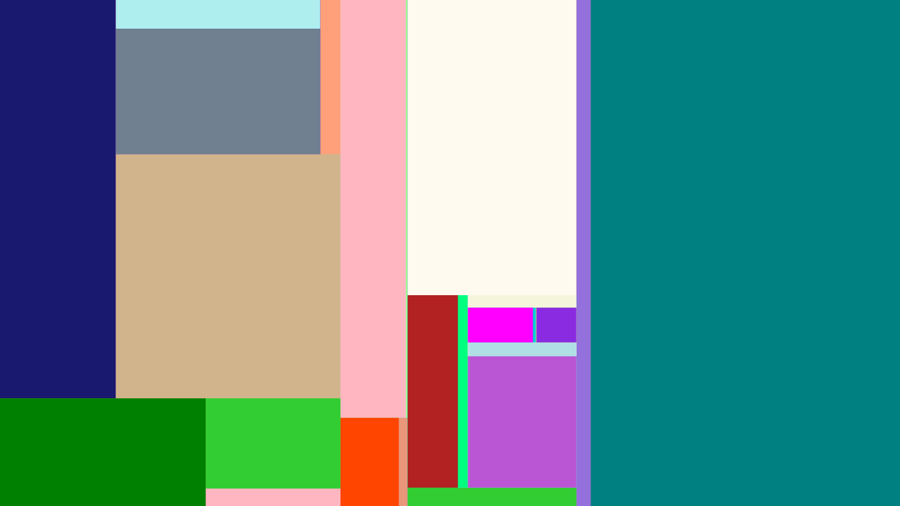

# MondrianArt
What is Mondrian Art?

https://en.wikipedia.org/wiki/Piet_Mondrian

Inspired by https://www.youtube.com/watch?v=uFJhEPrbycQ&list=PLFE6E58F856038C69&index=9

I used the same Algorithm and added Circles in each ractangle when applicable.

Coded is C# and WPF.

Few Examples -

